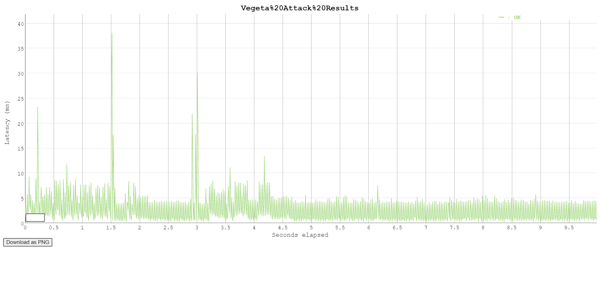

## Signature Server

- [Signature Server](#signature-server)
  - [Introduction](#introduction)
  - [Setup](#setup)
  - [Tools used](#tools-used)
  - [API Documentation](#api-documentation)
- [Parallelism](#parallelism)
- [Go version used](#go-version-used)
- [Future Improvements](#future-improvements)
  

### Introduction

Signature Server is a REST API Server written in Go that stores transaction blobs and sings them using ed25519 key

> NOTE: The public private key are to be provided as pem files in the `./pem/` directory and only the path is to the file is provided via `config.json` since `pem` is the standard for storing, encoding and decoding keys.

### Setup

* Modify the `config.json` file in the project root as needed. Sample Config:
```json
{
    "port": "3001",
    "private_key_path": "pem/private_key.pem",
    "public_key_path": "pem/public_key.pem",
    "log_file_name": "server.log"
}
```

* Generate a pem public-private ed25519 key-pair by running the command:
```sh
make keygen
```

It executes `utils/generate.go` and generates two files `public_key.pem` and `private_key.pem` in `pem/` directory

If you have your own pre-generated `ed25519` public and private key-pair, they have to be put inside the `pem/` directory with names `public_key.pem`  and `private_key.pem` respectively. If you choose to name it otherwise or put it in a different filepath (inside the project dir), please change the `private_key_path` and `public_key_path` values on `config.json` to the desired value

### Tools used

The following tools are used here:
1. REST API Framework - [`gin-gonic/gin`](https://github.com/gin-gonic/gin)
   * High-performance - gin-gonic is a wrapper around `httprouter` and is one of the fastest frameworks
   * Easily configurable - any later custom logger, auth, middleware to be added can be done with ease
   * Simple way to write response back - Easier straightforward way to write API response
  
2. Persistence Key Value store - [`badgerdb`](https://github.com/dgraph-io/badger)
   * Resilient to Crashes - since it uses Write Ahead Log
   * Fast - Writes can be made upto a speed of 160 MB/s \
    Source - https://dgraph.io/badger

> This project is `vendored` i.e the dependencies are shipped alongside in `vendor` folder. It also uses `go modules`- [Signature Server](#signature-server)
  - [Introduction](#introduction)
  - [Setup](#setup)
  - [Tools used](#tools-used)
  - [API Documentation](#api-documentation)
- [Signature Server](#signature-server)
  - [Introduction](#introduction)
  - [Setup](#setup)
  - [Tools used](#tools-used)
  - [API Documentation](#api-documentation)
- [Parallelism](#parallelism)
- [Go version used](#go-version-used)
- [Future Improvements](#future-improvements)

### API Documentation

1. `GET PUBLIC KEY`:

Returns `public_key` of the generated server keypair

Request:
```shell
curl --request GET \
     --url http://localhost:<port>/public_key \
```

Response:
```json
{
    "public_key": "9d09f5ab-82eb-4fa5-b965-54792ea80131"
}
```

2. `PUT TRANSACTION BLOB`

Takes in a transaction blob encoded as base64 string in the format 
```json
{
    "txn": "\A+B8oD==",
}
```

Returns the unique uuid identifier for the created transaction
```json
{
    "id": "9d09f5ab-82eb-4fa5-b965-54792ea80131"
}
```

The transaction value is persisted in the system using [`badger`](https://github.com/dgraph-io/badger)

3. `POST SIGNATURE`

Accepts a JSON key value pair of the format:
```json
{
    "ids": ["9d09f5ab-82eb-4fa5-b965-54792ea80131", "fc4b56d8-7418-49e2-b969-8567e7221209"]
}
```
which are generated unique identifiers for respective transactions. The persisted values in the DB are evaluated, appended and considered as a message.

This message is signed using the `ed25519` signature algorithm. For safety, the signature is verified on the server before sending it to the client.

After successfully verifying, the server sends a response containing the message that was signed as well as the signature. A sample signed response is as follows:
```json
{
  "message": ["BAUGBwg=","Udaya"],
  "signature": "XpARy3XLAVuu5o/GqLt3sfseVjT2zNBb/2X+AFzG89Xa5f8ryll2iBlvvZetKI9VonbC+uahFnDWTI7be6k8Bg=="
}
```

## Parallelism
`go` version greater than `1.5` automatically uses all cores of the machine. The number of cores available on the machine as well as the number of cores used is logged to `stdout`

`gin` uses `net/http` internally, which creates a unique go-routine for every request made thereby enabling high parallelism and performance.

The server's ability to serve massive volume of requests has been tested using `vegeta`.
The results of the `vegeta` load test attack can be found at directory `loadtest/results/html/`

Results: \


To perform a load test again, run:
```
make vegeta attack
```
> Note: Results are overwritten in the results folder
>
## Go version used
This project was developed in the following specs: \
`go version go1.15.2 linux/amd64`

## Future Improvements
* When storing a transaction, return a monotonically increasing integer as Unique Identifier instead of a UUID
* Replace standard `logger` with `zap` or `logrus`